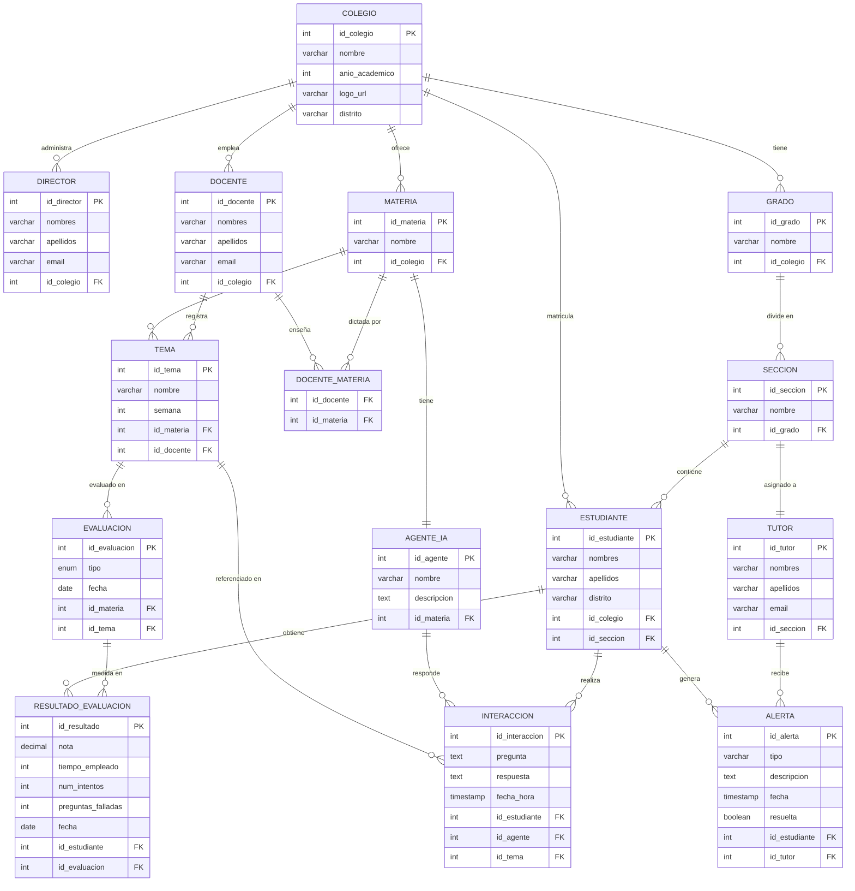

# EduInsight AI – Diagrama Entidad-Relación

## Entidades y Atributos

### COLEGIO
| Atributo        | Tipo     | Clave |
|-----------------|----------|-------|
| id_colegio      | INT      | PK    |
| nombre          | VARCHAR  |       |
| año_academico   | INT      |       |
| logo_url        | VARCHAR  |       |
| distrito        | VARCHAR  |       |

---

### GRADO
| Atributo   | Tipo    | Clave |
|------------|---------|-------|
| id_grado   | INT     | PK    |
| nombre     | VARCHAR |       |
| id_colegio | INT     | FK    |

---

### SECCION
| Atributo   | Tipo    | Clave |
|------------|---------|-------|
| id_seccion | INT     | PK    |
| nombre     | VARCHAR |       |
| id_grado   | INT     | FK    |

---

### DIRECTOR
| Atributo    | Tipo    | Clave |
|-------------|---------|-------|
| id_director | INT     | PK    |
| nombres     | VARCHAR |       |
| apellidos   | VARCHAR |       |
| email       | VARCHAR |       |
| id_colegio  | INT     | FK    |

---

### TUTOR
| Atributo   | Tipo    | Clave |
|------------|---------|-------|
| id_tutor   | INT     | PK    |
| nombres    | VARCHAR |       |
| apellidos  | VARCHAR |       |
| email      | VARCHAR |       |
| id_seccion | INT     | FK    |

> Un tutor está asignado a una sección (aula) específica.

---

### DOCENTE
| Atributo   | Tipo    | Clave |
|------------|---------|-------|
| id_docente | INT     | PK    |
| nombres    | VARCHAR |       |
| apellidos  | VARCHAR |       |
| email      | VARCHAR |       |
| id_colegio | INT     | FK    |

---

### MATERIA
| Atributo   | Tipo    | Clave |
|------------|---------|-------|
| id_materia | INT     | PK    |
| nombre     | VARCHAR |       |
| id_colegio | INT     | FK    |

---

### DOCENTE_MATERIA *(tabla intermedia)*
| Atributo   | Tipo | Clave |
|------------|------|-------|
| id_docente | INT  | FK    |
| id_materia | INT  | FK    |

> Un docente puede enseñar varias materias; una materia puede tener varios docentes.

---

### AGENTE_IA
| Atributo    | Tipo    | Clave |
|-------------|---------|-------|
| id_agente   | INT     | PK    |
| nombre      | VARCHAR |       |
| descripcion | TEXT    |       |
| id_materia  | INT     | FK    |

> Cada materia tiene un agente IA especializado (relación 1:1).

---

### ESTUDIANTE
| Atributo   | Tipo    | Clave |
|------------|---------|-------|
| id_estudiante | INT  | PK    |
| nombres    | VARCHAR |       |
| apellidos  | VARCHAR |       |
| distrito   | VARCHAR |       |
| id_colegio | INT     | FK    |
| id_seccion | INT     | FK    |

---

### TEMA
| Atributo   | Tipo    | Clave |
|------------|---------|-------|
| id_tema    | INT     | PK    |
| nombre     | VARCHAR |       |
| semana     | INT     |       |
| id_materia | INT     | FK    |
| id_docente | INT     | FK    |

---

### INTERACCION
| Atributo      | Tipo      | Clave |
|---------------|-----------|-------|
| id_interaccion| INT       | PK    |
| pregunta      | TEXT      |       |
| respuesta     | TEXT      |       |
| fecha_hora    | TIMESTAMP |       |
| id_estudiante | INT       | FK    |
| id_agente     | INT       | FK    |
| id_tema       | INT       | FK    |

---

### EVALUACION
| Atributo       | Tipo      | Clave |
|----------------|-----------|-------|
| id_evaluacion  | INT       | PK    |
| tipo           | ENUM      |       |
| fecha          | DATE      |       |
| id_materia     | INT       | FK    |
| id_tema        | INT       | FK    |

> Tipos: `temas_dia`, `semanal`, `simulacro`, `adaptativa`

---

### RESULTADO_EVALUACION
| Atributo        | Tipo    | Clave |
|-----------------|---------|-------|
| id_resultado    | INT     | PK    |
| nota            | DECIMAL |       |
| tiempo_empleado | INT     |       |
| num_intentos    | INT     |       |
| preguntas_falladas | INT  |       |
| fecha           | DATE    |       |
| id_estudiante   | INT     | FK    |
| id_evaluacion   | INT     | FK    |

---

### ALERTA
| Atributo      | Tipo      | Clave |
|---------------|-----------|-------|
| id_alerta     | INT       | PK    |
| tipo          | VARCHAR   |       |
| descripcion   | TEXT      |       |
| fecha         | TIMESTAMP |       |
| resuelta      | BOOLEAN   |       |
| id_estudiante | INT       | FK    |
| id_tutor      | INT       | FK    |

---

## Diagrama de Relaciones (Mermaid)

---

## Resumen de Cardinalidades

| Relación                          | Cardinalidad |
|-----------------------------------|--------------|
| Colegio → Grados                  | 1 : N        |
| Grado → Secciones                 | 1 : N        |
| Sección → Tutor                   | 1 : 1        |
| Sección → Estudiantes             | 1 : N        |
| Colegio → Docentes                | 1 : N        |
| Docente ↔ Materia                 | N : M        |
| Materia → Agente IA               | 1 : 1        |
| Materia → Temas                   | 1 : N        |
| Docente → Temas                   | 1 : N        |
| Estudiante → Interacciones        | 1 : N        |
| Agente IA → Interacciones         | 1 : N        |
| Tema → Interacciones              | 1 : N        |
| Estudiante → Resultados           | 1 : N        |
| Evaluación → Resultados           | 1 : N        |
| Estudiante → Alertas              | 1 : N        |
| Tutor → Alertas                   | 1 : N        |
