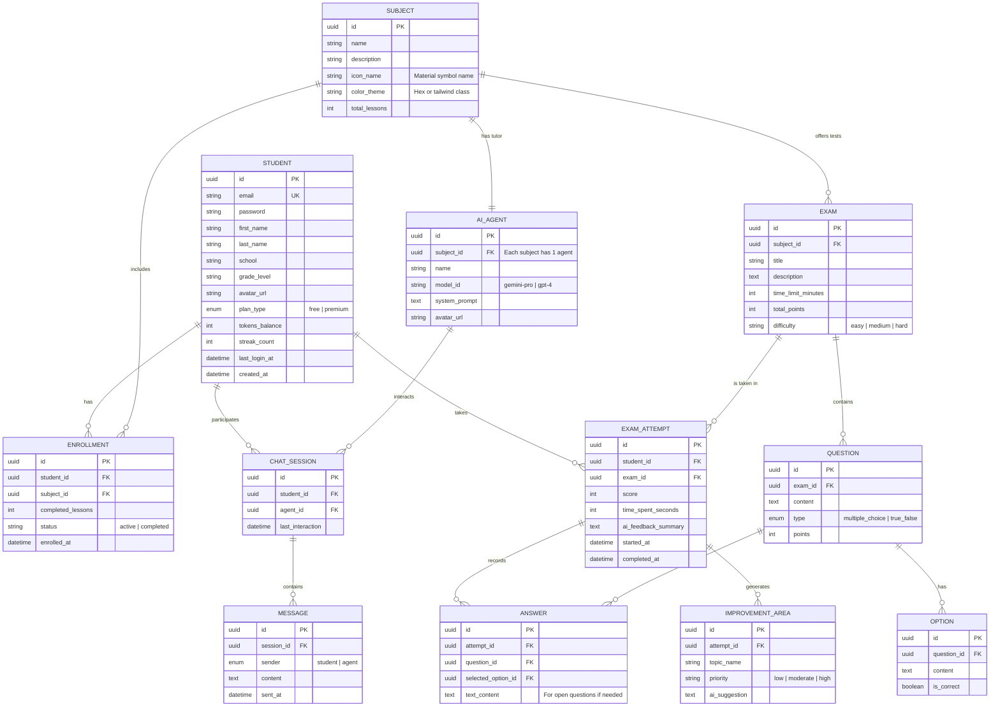

# Database Design: EduAI Platform

This document outlines the Entity-Relationship (ER) model for the EduAI platform, based on the requirements for student management, AI tutors per subject, and simulated exams.

## Entity-Relationship Diagram

## Key Considerations

1.  **AI Tutor Integration**: Each `SUBJECT` has a dedicated `AI_AGENT`. This agent acts as the tutor for all students enrolled in that subject.
2.  **Tracking Progress (Help Areas)**: By analyzing `EXAM_ATTEMPT` scores and `MESSAGE` content in `CHAT_SESSION`, the system can identify specific topics where a student needs more help.
3.  **Simulated Exams**: The `EXAM`, `QUESTION`, and `OPTION` entities allow for the creation of structured mock tests. `EXAM_ATTEMPT` tracks the performance history relative to real-world presence exams.
4.  **Hexagonal Architecture**: These entities will be implemented in the `apps/backend/src/domain/entities` layer to keep the business logic pure and decoupled from the persistence layer (TypeORM).
