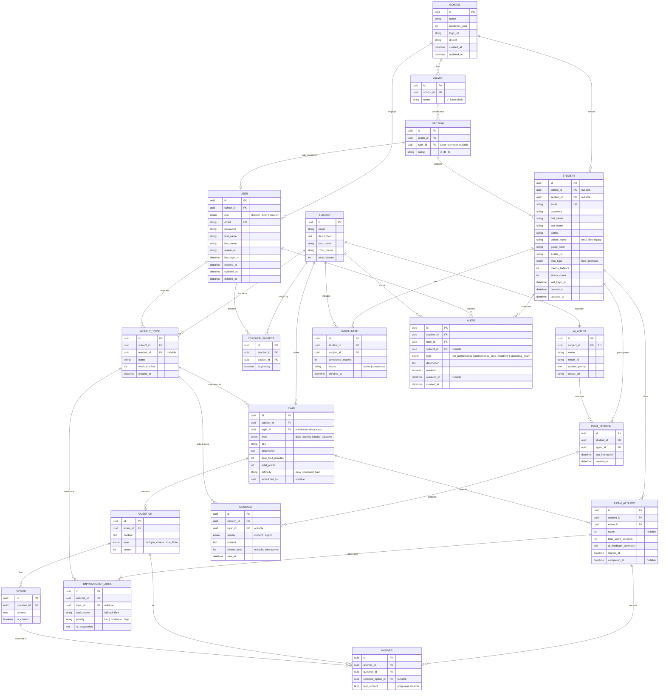

# MiColeAI — Documento Único del Proyecto

> Documento consolidado: visión del producto + diseño de base de datos **tal como está implementado** en el backend (`apps/backend/src/domain/entities`).
> Reemplaza a los antiguos `EduInsight-AI.md`, `EduInsight-ER.md` y `EduInsight-DB-Design.md`.

---

## PARTE 1 — Visión del Producto

### 1.1 Resumen
**MiColeAI** es una plataforma educativa que integra agentes de IA especializados por materia, evaluaciones (incluidas adaptativas) y analítica académica para **estudiantes, tutores, docentes y directores**. Convierte cada interacción, evaluación y comportamiento del estudiante en información accionable para intervenir a tiempo y mejorar el rendimiento.

### 1.2 Problemática
- Los docentes desconocen qué temas generan más dificultades.
- Los tutores no tienen alertas tempranas de estudiantes en riesgo.
- Los directores solo ven notas finales, no el proceso de aprendizaje.
- Las dudas fuera del aula no quedan registradas.
- Las evaluaciones no aportan información para decisiones pedagógicas.

### 1.3 Diferenciador
No es un chatbot aislado: es un **sistema integral de inteligencia académica institucional**. Cada conversación, examen y patrón de comportamiento alimenta la analítica.

### 1.4 Actores y funciones

| Actor | Funciones clave |
|-------|-----------------|
| **Director** | Configurar colegio, grados/secciones, registrar tutores y docentes, crear materias, ver dashboards institucionales, detectar riesgo |
| **Tutor** | Monitorear su aula, revisar alertas, detectar inactividad, coordinar intervenciones, identificar destacados |
| **Docente** | Registrar temas semanales, revisar desempeño por tema, analizar dudas frecuentes, generar reforzamientos |
| **Estudiante** | Interactuar con agentes IA, rendir evaluaciones, consultar progreso, ver próximos exámenes, recibir recomendaciones |

### 1.5 Módulos principales
- **Tutores IA por materia** — 1 agente por materia (relación 1:1).
- **Temas semanales** (`weekly_topics`) — eje analítico: chat, exámenes y áreas de mejora se anclan a un tema para responder *"¿qué tema genera más dudas / peor desempeño?"*.
- **Evaluaciones** — tipos `daily`, `weekly`, `mock`, `adaptive`.
- **Alertas tempranas** — `low_performance`, `performance_drop`, `inactivity`, `upcoming_exam`.
- **Dashboards** — estudiante (progreso, próximos exámenes, recomendaciones), tutor (indicadores de aula + alertas), director (analítica institucional).

---

## PARTE 2 — Diseño de Base de Datos (Implementado)

### 2.1 Stack y convenciones reales
- **Motor:** MySQL (driver `mysql2`).
- **ORM:** TypeORM (arquitectura hexagonal — entidades en `apps/backend/src/domain/entities`).
- **PK:** `uuid` (`@PrimaryGeneratedColumn('uuid')`) en todas las tablas.
- **Nomenclatura:** tablas y columnas en **inglés**, `snake_case` en BD; FKs como `<entidad>_id`.
- **Timestamps:** `created_at` / `updated_at` gestionados por TypeORM.

### 2.2 Diagrama Entidad-Relación

### 2.3 Tablas (19) y su rol

| # | Tabla | Rol |
|---|-------|-----|
| 1 | `schools` | Colegio (multi-tenant raíz) |
| 2 | `users` | Staff institucional: **director / tutor / teacher** (una sola tabla con enum `role`, soft-delete) |
| 3 | `grades` | Grado del colegio |
| 4 | `sections` | Sección/aula; referencia a su `tutor` (User) |
| 5 | `students` | Estudiante + gamificación (`tokens_balance`, `streak_count`, `plan_type`) |
| 6 | `subjects` | Materia + metadatos de UI (`icon_name`, `color_theme`, `total_lessons`) |
| 7 | `ai_agents` | Agente IA, **1:1** con materia (`model_id`, `system_prompt`) |
| 8 | `teacher_subjects` | N:M docente↔materia (`is_primary` marca al titular) |
| 9 | `weekly_topics` | **Eje analítico**: tema semanal registrado por docente |
| 10 | `enrollments` | Matrícula estudiante↔materia + progreso |
| 11 | `exams` | Evaluación (4 tipos), `scheduled_for` alimenta "Próximos exámenes" |
| 12 | `questions` | Pregunta del examen |
| 13 | `options` | Alternativas con `is_correct` |
| 14 | `exam_attempts` | Intento/resultado + `ai_feedback_summary` |
| 15 | `answers` | Respuesta del estudiante por pregunta |
| 16 | `improvement_areas` | Áreas débiles detectadas por la IA (ligadas a `weekly_topics`) |
| 17 | `chat_sessions` | Sesión de chat estudiante↔agente |
| 18 | `messages` | Mensaje del chat (`sender`, `tokens_used`, ligado a tema) |
| 19 | `alerts` | Alertas tempranas estudiante↔tutor (diferenciador del producto) |

### 2.4 Decisiones de diseño relevantes

| Decisión | Justificación |
|----------|---------------|
| **`uuid` como PK** | Evita colisiones, seguro para exponer en APIs/multi-tenant |
| **Una tabla `users` con enum `role`** | Director/tutor/docente comparten email/password/nombre; evita 3 tablas duplicadas. Los estudiantes van aparte en `students` por su gamificación |
| **`weekly_topics` como eje analítico** | `messages`, `exams` e `improvement_areas` apuntan a `topic_id` → permite analítica "por tema" |
| **`topic_id` nullable** | Simulacros integrales y consultas ad-hoc no siempre tienen tema; `topic_name` actúa de fallback |
| **`alerts` con `student_id` + `tutor_id`** | Conecta al observado con quien debe intervenir; `subject_id` nullable (inactividad puede ser global) |
| **`school_name`/`grade_level` libres en `students`** | Campos legacy para mostrar sin join; la FK real es `school` / `section` |

### 2.5 Estado de implementación
✅ Las 19 entidades existen en `apps/backend/src/domain/entities`.
✅ `seed.js` puebla `subjects`, `ai_agents`, `students` y `enrollments` (datos de prueba).
⚠️ Pendiente: seed de la jerarquía institucional (`schools`, `users`, `grades`, `sections`) y de evaluaciones/alertas.
